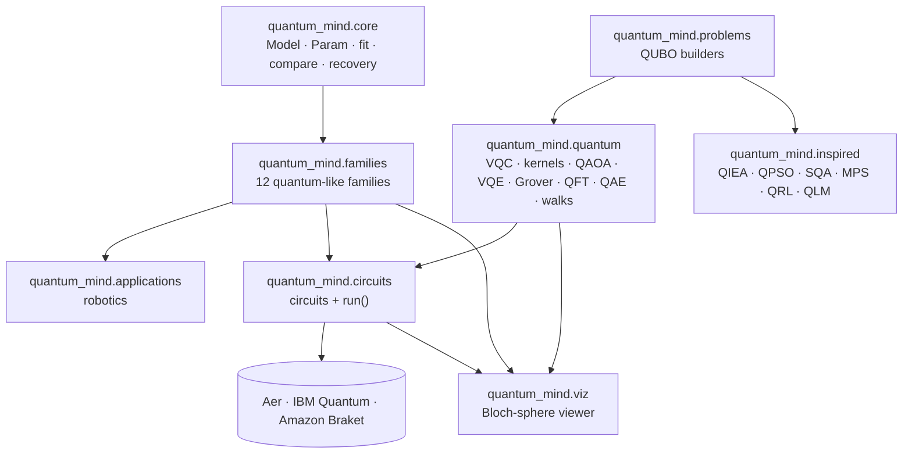

<p align="center">
  
</p>

<p align="center">
  <a href="https://pypi.org/project/quantum-mind/"></a>
  <a href="https://pypistats.org/packages/quantum-mind"></a>
  <a href="https://pepy.tech/projects/quantum-mind"></a>
  <a href="https://github.com/yeshwanthguru/Quantum-mind/actions/workflows/tests.yml"></a>
  <a href="https://github.com/yeshwanthguru/Quantum-mind/blob/main/LICENSE"></a>
  
  
  
  <a href="https://yeshwanthguru.github.io/Quantum-mind/docs/"></a>
</p>

<p align="center"><b><a href="https://yeshwanthguru.github.io/Quantum-mind/">Website and live Bloch-sphere playground</a> · <a href="https://yeshwanthguru.github.io/Quantum-mind/docs/">Documentation</a> (user guide, example gallery, API reference)</b></p>

<p align="center">
  <b><a href="#pillars">Three pillars</a></b> ·
  <b><a href="#viewer">Bloch viewer</a></b> ·
  <b><a href="#quick-start">Quick start</a></b> ·
  <b><a href="#catalogue">Catalogue</a></b> ·
  <b><a href="#examples">Examples</a></b> ·
  <b><a href="#hardware">Hardware</a></b> ·
  <b><a href="#status">Status</a></b> ·
  <b><a href="https://yeshwanthguru.github.io/Quantum-mind/docs/tutorials/index.html">Tutorials</a></b> ·
  <b><a href="https://yeshwanthguru.github.io/Quantum-mind/docs/learn/index.html">Foundations</a></b> ·
  <b><a href="https://yeshwanthguru.github.io/Quantum-mind/docs/atlas/index.html">Model atlas</a></b> ·
  <b><a href="https://github.com/yeshwanthguru/Quantum-mind/tree/main/notebooks">Notebooks</a></b> ·
  <b><a href="https://yeshwanthguru.github.io/Quantum-mind/docs/api/index.html">API</a></b> ·
  <b><a href="https://github.com/yeshwanthguru/Quantum-mind/blob/main/docs/concepts.md">Concepts</a></b>
</p>

---

**Quantum Mind** (`pip install quantum-mind`, `import quantum_mind`) is one library for the three ways
"quantum" enters modelling today:

- **quantum-like** models of how people judge, decide and trust, each paired with the classical models
  it must beat;
- **quantum** machine learning and algorithms as Qiskit circuits;
- **quantum-inspired** classical optimisers and tensor networks.

All three share one problem format, one fitting and comparison workflow, and one 3D Bloch-sphere
viewer. Every circuit runs on Aer, IBM Quantum and Amazon Braket. The library was built for robots
and AI agents that work with people, and it applies equally to surveys, finance, medicine, consumer
research, physics and operations research.

> Quantum-like models use the mathematics of quantum probability to describe judgements. They run on
> ordinary computers and do not claim that the brain is a quantum computer. Quantum models are
> circuits for quantum hardware. Quantum-inspired models are classical algorithms. The
> [concepts page](https://github.com/yeshwanthguru/Quantum-mind/blob/main/docs/concepts.md) explains the difference and how to test each.

<a id="pillars"></a>

## Three pillars

<table>
<tr>
<th width="33%">Quantum-like</th>
<th width="33%">Quantum</th>
<th width="33%">Quantum-inspired</th>
</tr>
<tr valign="top">
<td>

Models of **human** judgement, decision and trust in quantum probability. Each comes with its
classical baselines and distinctive tests.

- order effects · conjunction · interference
- quantum-like Bayesian networks
- quantum, Markov and open-system dynamics
- quantum decision theory · contextuality · similarity
- quantum games · episodic memory · concept combination
- **robotics**: questioning designs, trust, intent resolution, human-model ensemble

`quantum_mind.families`, `quantum_mind.applications`

</td>
<td>

**Gate-model** machine learning and algorithms. They train on a fast built-in simulator and export
to Qiskit.

- variational (re-uploading) classifier and regressor
- quantum kernel: classification, anomaly detection, clustering
- QAOA for any QUBO · VQE for Pauli Hamiltonians
- Grover search · quantum Fourier transform
- amplitude estimation · continuous-time quantum walks
- circuits for the quantum-like families

`quantum_mind.quantum`, `quantum_mind.circuits`

</td>
<td>

**Classical** algorithms that borrow quantum ideas. No quantum computer is needed.

- quantum-inspired evolutionary algorithm (QIEA)
- quantum-behaved particle swarm (QPSO)
- simulated quantum annealing (path-integral Monte Carlo)
- tensor-network (MPS) classifier
- quantum reinforcement learning (amplitude-based exploration)
- quantum language model for document ranking
- classical simulated-annealing baseline

`quantum_mind.inspired`

</td>
</tr>
</table>

Shared layers: `quantum_mind.core` (fitting, BIC/AIC comparison, model recovery), `quantum_mind.problems` (QUBO
builders for MaxCut, knapsack, multi-robot task allocation, portfolio and Ising problems) and
`quantum_mind.viz` (the 3D Bloch-sphere viewer).

<a id="viewer"></a>

## See the qubits

<table>
<tr>
<td align="center" width="62%"><br>
<sub>A Qiskit circuit, gate by gate. While the qubits are entangled, their vectors leave the sphere.<br><code>circuit_trajectory(qc)</code> → <code>animate_trajectory</code> / <code>animate_bloch</code></sub></td>
<td align="center" width="38%"><br>
<sub>Trust in a robot as a qubit, over successes and failures, with dephasing.<br><code>belief_trajectory(OpenSystemBelief(), events)</code></sub></td>
</tr>
</table>

```python
from qiskit import QuantumCircuit
from quantum_mind.viz import circuit_trajectory, animate_bloch, save_html, LiveBloch, bloch_tomography

qc = QuantumCircuit(2); qc.h(0); qc.cx(0, 1); qc.ry(0.6, 1)
traj = circuit_trajectory(qc, steps=15)
save_html(animate_bloch(traj), 'bell.html')        # interactive: rotate, zoom, play, slider
LiveBloch(2).show().play(traj)                     # real time in Jupyter or a Matplotlib window
bloch_tomography(qc, 'aer:FakeTorino')             # Bloch vectors measured under IBM device noise
traj.concurrence(0, 1)                              # entanglement of the pair along the circuit
```

<p align="center"><br>
<sub>The same circuit as a timeline: <code>plot_entanglement(traj)</code> shows each qubit's Bloch-vector length and the pair's concurrence (Wootters); <code>plot_qsphere(state)</code> draws the Q-sphere.</sub></p>

Interactive versions of both animations (rotate, zoom, play, slider) are written by
[`examples/19`](https://github.com/yeshwanthguru/Quantum-mind/blob/main/examples/19_bloch_sphere_viewer.py) and [`examples/20`](https://github.com/yeshwanthguru/Quantum-mind/blob/main/examples/20_trust_on_the_bloch_sphere.py),
and shown inline in the [notebooks](https://github.com/yeshwanthguru/Quantum-mind/tree/main/notebooks). The [viewer README](https://github.com/yeshwanthguru/Quantum-mind/blob/main/src/quantum_mind/viz/README.md) covers everything else.

<a id="quick-start"></a>

## Quick start

```bash
pip install "quantum-mind[all]"
```

<details open>
<summary><b>Quantum-like: is there a question-order effect, and which model explains it?</b></summary>

```python
import numpy as np
from quantum_mind.core import compare
from quantum_mind.families.order_effects import QuantumOrderModel4D, BayesOrderModel, AnchoringOrderModel, qq_test

counts = {'AB': np.array([212, 48, 61, 179]),   # A asked first: yes-yes, yes-no, no-yes, no-no
          'BA': np.array([240, 33, 52, 175])}   # B asked first
print(qq_test(counts))                           # parameter-free test of the quantum-like prediction
for r in compare([QuantumOrderModel4D, BayesOrderModel, AnchoringOrderModel], counts):
    print(type(r.model).__name__, round(r.bic, 1))
```
</details>

<details>
<summary><b>Quantum: classify with a circuit, then run it under IBM device noise</b></summary>

```python
from quantum_mind.quantum import VariationalClassifier
from quantum_mind.circuits import run

clf = VariationalClassifier(layers=3).fit(X_train, y_train)
print(clf.score(X_test, y_test))
counts = run(clf.to_qiskit(X_test[0]), 'aer:FakeTorino', shots=4000)
```
</details>

<details>
<summary><b>Quantum-inspired: one robot task-allocation problem, three kinds of solver</b></summary>

```python
from quantum_mind.problems import task_allocation
from quantum_mind.quantum import QAOA
from quantum_mind.inspired import SQA, QIEA, simulated_annealing

q = task_allocation(costs)                       # costs[robot, task]
print(q.brute_force()[1],                        # exact
      QAOA(q, p=3).run().energy,                 # quantum
      SQA(q).run().value, QIEA(q).run().value,   # quantum-inspired
      simulated_annealing(q).value)              # classical baseline
```
</details>

<details>
<summary><b>Robotics: a human model with uncertainty, for a planner or a ROS 2 system</b></summary>

```python
from quantum_mind.applications.robotics import HumanModelService

svc = HumanModelService()                                   # wraps HumanModelEnsemble + ask_or_act
svc.add_answer({'order': 'AB', 'answers': [1, 0]})          # one person's two answers (1 = yes)
svc.query({'order': 'AB', 'ask_cost': 1.0, 'error_cost': 3.0})
# -> prediction, uncertainty (entropy, model disagreement in bits), ensemble weights, 'ask' or 'act'
```

The same service runs as a ROS 2 node with standard `std_msgs/String` JSON topics:
[`integrations/ros2`](https://github.com/yeshwanthguru/Quantum-mind/blob/main/integrations/ros2/README.md).
</details>

<p align="center"></p>
<p align="center"></p>
<p align="center"><sub>Generated by <code>docs/make_assets.py</code> from the package itself (simulated data).</sub></p>

<a id="catalogue"></a>

## Model catalogue

<details>
<summary><b>Quantum-like families</b>: 12 families, each with classical baselines and a README</summary>

| Family | Phenomenon | Quantum-like model(s) | Classical baselines | Circuit | README |
|---|---|---|---|---|---|
| `order_effects` | Answers depend on question order | `QuantumOrderModel4D` (nests Bayes), `QuantumOrderModel` (3D, ranks) | Bayes, anchoring, saturated | yes | [link](https://github.com/yeshwanthguru/Quantum-mind/blob/main/src/quantum_mind/families/order_effects/README.md) |
| `conjunction` | Conjunction and disjunction fallacies | `QuantumConjunctionModel` | classical joint, averaging, probability theory plus noise | yes | [link](https://github.com/yeshwanthguru/Quantum-mind/blob/main/src/quantum_mind/families/conjunction/README.md) |
| `interference` | Disjunction effect, sure-thing violations | `InterferenceModel` (normalised or not) | classical mixture | yes | [link](https://github.com/yeshwanthguru/Quantum-mind/blob/main/src/quantum_mind/families/interference/README.md) |
| `qlbn` | Inference with unresolved hidden causes | quantum-like Bayesian network | classical Bayesian network | yes | [link](https://github.com/yeshwanthguru/Quantum-mind/blob/main/src/quantum_mind/families/qlbn/README.md) |
| `dynamics` | Belief change over time; judgements that change later judgements | `QuantumWalk`, `OpenSystemWalk`, `OpenSystemBelief` | `MarkovWalk`, `MarkovBelief` | yes | [link](https://github.com/yeshwanthguru/Quantum-mind/blob/main/src/quantum_mind/families/dynamics/README.md) |
| `decision` | Risky choice | `QDTModel` (quantum decision theory) | expected utility, prospect theory | no | [link](https://github.com/yeshwanthguru/Quantum-mind/blob/main/src/quantum_mind/families/decision/README.md) |
| `contextuality` | Is there one joint distribution? | CHSH, Contextuality-by-Default criterion | classical bounds | yes | [link](https://github.com/yeshwanthguru/Quantum-mind/blob/main/src/quantum_mind/families/contextuality/README.md) |
| `similarity` | Asymmetric similarity | `QuantumSimilarityModel` | biased geometric (Nosofsky), geometric | yes | [link](https://github.com/yeshwanthguru/Quantum-mind/blob/main/src/quantum_mind/families/similarity/README.md) |
| `game_theory` | Strategic choice with shared quantum resources | `EWLGame` (Eisert–Wilkens–Lewenstein), best responses, Nash checks | classical Nash equilibria | no | [link](https://github.com/yeshwanthguru/Quantum-mind/blob/main/src/quantum_mind/families/game_theory/README.md) |
| `memory` | Episodic overdistribution in recall | `QuantumEpisodicModel` (Brainerd) | additive (verbatim + gist) | no | [link](https://github.com/yeshwanthguru/Quantum-mind/blob/main/src/quantum_mind/families/memory/README.md) |
| `concepts` | Overextension in concept combination ("pet fish") | `FockSpaceConceptModel` (Aerts) | product, minimum (fuzzy), weighted average | no | [link](https://github.com/yeshwanthguru/Quantum-mind/blob/main/src/quantum_mind/families/concepts/README.md) |

Robotics application ([README](https://github.com/yeshwanthguru/Quantum-mind/blob/main/src/quantum_mind/applications/README.md)): question domains (object
clarification, trust and hand-over, preference elicitation), questioning designs (fixed, probe,
split), a trust protocol, `HumanModelEnsemble`, and Bayesian and quantum-like intent resolvers
(`applications.intent`) for ambiguous commands.
</details>

<details>
<summary><b>Quantum models</b>: QML and algorithms (<a href="https://github.com/yeshwanthguru/Quantum-mind/blob/main/src/quantum_mind/quantum/README.md">README</a>)</summary>

| Model | Use | Reference |
|---|---|---|
| `VariationalClassifier` | multi-class classification with data re-uploading | Pérez-Salinas et al., *Quantum* 2020 |
| `QuantumKernel`, `QuantumKernelClassifier` | fidelity kernel (ZZ map), kernel ridge; works with scikit-learn | Havlíček et al., *Nature* 2019 |
| `QAOA` | any `Qubo`: allocation, scheduling, MaxCut, portfolios | Farhi et al., 2014 |
| `VQE`, `Hamiltonian` | ground states of Pauli Hamiltonians or QUBOs | Peruzzo et al., *Nat. Commun.* 2014 |
| `grover` | search with an oracle from a list or a predicate | Grover, 1996 |
| `VariationalRegressor` | regression and forecasting (⟨Z⟩ readout, adjoint gradients) | Mitarai et al., *PRA* 2018 |
| `QuantumKernelAnomalyDetector`, `QuantumKernelClustering` | one-class anomaly scores and spectral clustering, quantum or RBF kernel | Liu and Rebentrost, *PRA* 2018 |
| `qft_circuit`, `find_period` | quantum Fourier transform and period finding | Coppersmith, 1994; Shor, 1994 |
| `AmplitudeEstimation` | expected values (risk, pricing) with maximum-likelihood amplitude estimation | Suzuki et al., *QIP* 2020 |
| `ctqw_probabilities`, `quantum_walk_centrality` | continuous-time quantum walks on graphs; node centrality | Farhi and Gutmann, *PRA* 1998 |
| `quantum_mind.circuits` | circuits of the quantum-like families; `run()` on any backend | [circuits README](https://github.com/yeshwanthguru/Quantum-mind/blob/main/src/quantum_mind/circuits/README.md) |
</details>

<details>
<summary><b>Quantum-inspired models</b>: optimisers, tensor networks, learning and ranking (<a href="https://github.com/yeshwanthguru/Quantum-mind/blob/main/src/quantum_mind/inspired/README.md">README</a>)</summary>

| Model | Problem | Reference |
|---|---|---|
| `QIEA` | binary optimisation (Han and Kim's rotation table) | Han and Kim, *IEEE TEVC* 2002 |
| `QPSO` | continuous optimisation | Sun, Feng and Xu, *CEC* 2004 |
| `SQA` | Ising / QUBO by path-integral Monte Carlo | Martoňák, Santoro and Tosatti, *PRB* 2002 |
| `MPSClassifier` | supervised classification with a matrix product state; DMRG-style sweeps or Adam | Stoudenmire and Schwab, *NeurIPS* 2016 |
| `QuantumInspiredQLearning` | reinforcement learning with action amplitudes (baseline: `QLearning`) | Dong et al., *IEEE TSMC-B* 2008 |
| `QuantumLanguageModel` | document ranking with density matrices (baseline: `QueryLikelihoodModel`) | Sordoni, Nie and Bengio, *SIGIR* 2013 |
| `simulated_annealing` | classical baseline | Kirkpatrick et al., *Science* 1983 |
</details>

## Architecture



```
src/quantum_mind/
├── core/           Lüders rule, density matrices, Lindblad · Model/Param · fit, compare, recovery
├── families/       order_effects · conjunction · interference · qlbn · dynamics · decision · contextuality · similarity · game_theory · memory · concepts
├── applications/   robotics: question domains, questioning designs, trust, intent resolution, human-model ensemble, ask_or_act, HumanModelService
├── quantum/        statevector simulator · ansatz · classifiers · QAOA · VQE · Grover · QFT · amplitude estimation · walks
├── inspired/       QIEA · QPSO · SQA · simulated annealing · MPS classifier · QRL · quantum language model
├── problems/       QUBO builders shared by quantum and quantum-inspired solvers
├── circuits/       Qiskit circuits of the families · run() on Aer, IBM Quantum, Amazon Braket
├── viz/            Bloch vectors, trajectories, tomography · Matplotlib and Plotly viewers · LiveBloch
└── data/           published aggregate data sets
examples/           31 scripts across domains        docs/       Sphinx documentation, concepts, assets
notebooks/          2 Jupyter notebooks              tests/      63 tests
integrations/ros2/  ROS 2 node (quantum_mind_ros)
site/               project website (built and deployed to GitHub Pages by CI)
.github/            CI, release, website, CODEOWNERS, issue and pull-request templates
```

<a id="examples"></a>

## Examples across domains

Pillar: QL quantum-like, Q quantum, QI quantum-inspired, viz Bloch-sphere viewer.

| # | Domain | Pillar | Script |
|---|---|---|---|
| 01 | Surveys, market research | QL | [question-order effects, QQ test](https://github.com/yeshwanthguru/Quantum-mind/blob/main/examples/01_survey_question_order.py) |
| 02 | Behavioural finance | QL | [disjunction effect, interference, QLBN](https://github.com/yeshwanthguru/Quantum-mind/blob/main/examples/02_finance_disjunction_effect.py) |
| 03 | Medical decision support | QL | [quantum-like Bayesian network](https://github.com/yeshwanthguru/Quantum-mind/blob/main/examples/03_medical_diagnosis_qlbn.py) |
| 04 | Consumer choice | QL | [quantum decision theory vs EU and PT](https://github.com/yeshwanthguru/Quantum-mind/blob/main/examples/04_consumer_choice_qdt.py) |
| 05 | AI / LLM evaluation | QL | [order effects in judgements](https://github.com/yeshwanthguru/Quantum-mind/blob/main/examples/05_llm_evaluation_order.py) |
| 06 | Human–computer interaction | QL | [trust dynamics](https://github.com/yeshwanthguru/Quantum-mind/blob/main/examples/06_hci_trust_dynamics.py) |
| 07 | Perception, confidence | QL | [Markov vs quantum walk](https://github.com/yeshwanthguru/Quantum-mind/blob/main/examples/07_evidence_accumulation.py) |
| 08 | Physics, psychology | QL, Q | [CHSH and Contextuality-by-Default](https://github.com/yeshwanthguru/Quantum-mind/blob/main/examples/08_contextuality_analysis.py) |
| 09 | Marketing, linguistics | QL | [asymmetric similarity](https://github.com/yeshwanthguru/Quantum-mind/blob/main/examples/09_similarity_asymmetry.py) |
| 10 | – | Q | [every family as a circuit (Aer, FakeTorino, Braket)](https://github.com/yeshwanthguru/Quantum-mind/blob/main/examples/10_circuits_quickstart.py) |
| 11 | – | Q | [IBM Quantum / Amazon Braket hardware](https://github.com/yeshwanthguru/Quantum-mind/blob/main/examples/11_cloud_run.py) |
| 12 | Robotics, HRI | QL | [robot questioning and trust](https://github.com/yeshwanthguru/Quantum-mind/blob/main/examples/12_robot_questioning_trust.py) |
| 13 | Medicine (simulated) | Q, QI | [VQC, quantum kernel, MPS vs logistic regression](https://github.com/yeshwanthguru/Quantum-mind/blob/main/examples/13_quantum_classifiers_triage.py) |
| 14 | Robotics | Q, QI | [multi-robot task allocation: QAOA, SQA, QIEA, SA](https://github.com/yeshwanthguru/Quantum-mind/blob/main/examples/14_qaoa_multi_robot_allocation.py) |
| 15 | Finance (simulated) | Q, QI | [portfolio selection](https://github.com/yeshwanthguru/Quantum-mind/blob/main/examples/15_portfolio_selection.py) |
| 16 | Physics, materials | Q | [VQE on a transverse-field Ising chain](https://github.com/yeshwanthguru/Quantum-mind/blob/main/examples/16_vqe_ising_chain.py) |
| 17 | Scheduling | Q | [Grover search for valid schedules](https://github.com/yeshwanthguru/Quantum-mind/blob/main/examples/17_grover_schedule_search.py) |
| 18 | Control, robotics | QI | [PID tuning with QPSO](https://github.com/yeshwanthguru/Quantum-mind/blob/main/examples/18_qpso_controller_tuning.py) |
| 19 | Visualisation | viz | [Bloch-sphere viewer, HTML, GIF, live, tomography](https://github.com/yeshwanthguru/Quantum-mind/blob/main/examples/19_bloch_sphere_viewer.py) |
| 20 | Robotics, HRI | QL, viz | [trust on the Bloch sphere](https://github.com/yeshwanthguru/Quantum-mind/blob/main/examples/20_trust_on_the_bloch_sphere.py) |
| 21 | Robotics | QL | [when to ask for help: ensemble uncertainty and `ask_or_act`](https://github.com/yeshwanthguru/Quantum-mind/blob/main/examples/21_robot_ask_for_help.py) |
| 22 | Surveys, HRI | QL | [individual differences: pooled versus per-person model comparison](https://github.com/yeshwanthguru/Quantum-mind/blob/main/examples/22_individual_differences.py) |
| 23 | Economics, multi-agent | QL | [quantum games: EWL Prisoner's Dilemma and Chicken](https://github.com/yeshwanthguru/Quantum-mind/blob/main/examples/23_quantum_games.py) |
| 24 | Memory, language | QL | [episodic overdistribution and concept combination (simulated)](https://github.com/yeshwanthguru/Quantum-mind/blob/main/examples/24_memory_and_concepts.py) |
| 25 | Robotics, HRI | QL | [resolving an ambiguous command: Bayesian vs quantum-like intent](https://github.com/yeshwanthguru/Quantum-mind/blob/main/examples/25_intent_resolution_robot.py) |
| 26 | Finance, risk | Q | [amplitude estimation vs Monte Carlo](https://github.com/yeshwanthguru/Quantum-mind/blob/main/examples/26_risk_amplitude_estimation.py) |
| 27 | Signal processing | Q | [quantum Fourier transform and period finding](https://github.com/yeshwanthguru/Quantum-mind/blob/main/examples/27_qft_period_finding.py) |
| 28 | Networks | Q | [quantum-walk centrality vs PageRank and degree](https://github.com/yeshwanthguru/Quantum-mind/blob/main/examples/28_network_centrality_quantum_walk.py) |
| 29 | Forecasting, monitoring (simulated) | Q | [variational regressor, anomaly detection, clustering vs classical](https://github.com/yeshwanthguru/Quantum-mind/blob/main/examples/29_forecasting_and_anomalies.py) |
| 30 | Robotics | QI | [navigation: quantum-inspired RL vs Q-learning](https://github.com/yeshwanthguru/Quantum-mind/blob/main/examples/30_robot_navigation_qrl.py) |
| 31 | Information retrieval | QI | [document ranking: quantum language model vs query likelihood](https://github.com/yeshwanthguru/Quantum-mind/blob/main/examples/31_document_ranking_qlm.py) |
| 32 | Robotics, perception | classical | [calibration, conformal sets and hazard-aware ask-or-act](https://github.com/yeshwanthguru/Quantum-mind/blob/main/examples/32_calibration_and_conformal.py) |
| 33 | Robotics, perception | QL | [fusing detector, speech and gaze: Bayes, Dempster-Shafer, quantum-like](https://github.com/yeshwanthguru/Quantum-mind/blob/main/examples/33_multimodal_fusion.py) |
| 34 | Perception | QL | [bistable perception: quantum Zeno vs Markov and gamma renewal](https://github.com/yeshwanthguru/Quantum-mind/blob/main/examples/34_bistable_perception_zeno.py) |
| 35 | Learning, HRI | QI, Q | [RL with simulated people: amplitude exploration, quantum policy](https://github.com/yeshwanthguru/Quantum-mind/blob/main/examples/35_rl_with_simulated_people.py) |
| 36 | Robotics, HRI | QL | [trust-aware hand-over vs Markov-based and always hand over](https://github.com/yeshwanthguru/Quantum-mind/blob/main/examples/36_trust_aware_handover.py) |
| 37 | Robotics, HRI | QL, QI | [robot that adapts to each person: online posterior, adaptive conformal sets, trust-aware allocation](https://github.com/yeshwanthguru/Quantum-mind/blob/main/examples/37_robot_adapts_to_each_person.py) |

Notebooks: [`01_bloch_sphere_live`](https://github.com/yeshwanthguru/Quantum-mind/blob/main/notebooks/01_bloch_sphere_live.ipynb) (interactive and live spheres,
tomography under device noise) and [`02_robot_questioning_and_trust`](https://github.com/yeshwanthguru/Quantum-mind/blob/main/notebooks/02_robot_questioning_and_trust.ipynb)
(order effects, ensemble, ask-or-act, trust on the sphere). Both run in CI.

Results printed by the examples (simulated data, this version). They illustrate the methods on small
problems; they are not a benchmark, and on classification, forecasting, anomaly detection and clustering a
well-specified classical model wins (bold):

| Task | Result |
|---|---|
| Triage classification, test accuracy, mean ± sd over 10 seeds | **classical logistic regression on quadratic features 0.926 ± 0.016** · MPS 0.915 ± 0.015 · VQC 0.870 ± 0.033 · linear logistic regression 0.814 ± 0.041 · quantum kernel 0.781 ± 0.040 |
| Robot task allocation (3 × 3) | QAOA, SQA, QIEA and SA all reach the optimum; QAOA P(optimal) 0.04 ideal, 0.03 under FakeTorino noise (sampled), against 0.002 uniform |
| Portfolio, 3 of 8 assets | QAOA (p = 2), SQA, QIEA and SA all optimal; QAOA P(optimal) 0.014 against 0.004 uniform |
| VQE, 4-spin Ising chain | error below 1e-8 against exact diagonalisation |
| Grover, 9 of 32 schedules valid | P(valid) 0.99 after one iteration (random 0.28) |
| Trust qubit | P(trust) from the Bloch vector equals the model's prediction (0.7247) |
| Expected payoff, 6,800 oracle calls | amplitude estimation RMSE 0.0014, Monte Carlo 0.0049 (ideal simulator, no noise) |
| Forecasting, held-out R² | **linear autoregression 0.984** · variational quantum regressor 0.962 |
| Anomaly detection, AUC | **RBF kernel 1.000** · quantum kernel 0.905 (angle encoding is periodic, so far-out points wrap around) |
| Clustering, accuracy | **RBF kernel 1.000** · quantum kernel 0.931 |
| Grid navigation (shortest path 10) | QRL 10.0 steps per episode after training, Q-learning 10.6; QRL slower in the first 20 episodes |
| Concept combination ("pet and fish") | Fock-space SSE 0.001 · weighted average 0.054 · minimum 0.328 · product 0.388 |

<a id="hardware"></a>

## Running on quantum hardware

```bash
python3 examples/11_cloud_run.py --dry-run                                  # local, no account
python3 examples/11_cloud_run.py --backend ibm:least_busy --shots 4000      # IBM Quantum
python3 examples/11_cloud_run.py --backend braket:arn:aws:braket:us-east-1::device/qpu/ionq/Forte-1 --shots 1000
```

`run(circuit, backend)` accepts `aer`, `aer:<FakeBackend>`, `braket_local`, `braket_dm:<p>`,
`ibm:<device>` and `braket:<ARN>`. Every `to_qiskit()` circuit in `quantum_mind.quantum` and every builder
in `quantum_mind.circuits` works with it. Hardware runs cost queue time or money. Report their results
exactly as measured, with backend, date and job identifier.

| Backend | Status |
|---|---|
| Aer (ideal), Aer with IBM device noise models, Braket local and density-matrix simulators | tested in CI |
| IBM Quantum hardware (`ibm:<device>`) | submission code tested in CI against a fake IBM device (same transpilation, SamplerV2 call and result parsing); **not yet run on hardware** |
| Amazon Braket QPUs (`braket:<ARN>`) | submission code tested in CI with the local simulator as the device (same OpenQASM 3 program and `device.run` call); **not yet run on hardware** |

No hardware results are included in the package. IBM jobs use the client-side Qiskit Runtime
Sampler (`qiskit_ibm_runtime.executor_sampler`), falling back to `SamplerV2` on releases before 0.50.

<a id="status"></a>

## A packaged use case: trust-aware hand-over

[`tutorials/trust_handover_package`](https://github.com/yeshwanthguru/Quantum-mind/tree/main/tutorials/trust_handover_package)
turns one robotics model into an installable package (`quantum-handover`): a robot arm decides before
each hand-over whether to hand over, hand over slowly, ask or wait, using the quantum-like trust model.
It has a benchmark against two populations of simulated people, a PyBullet simulation recorded as a GIF,
a ROS 2 node, its own tests and a `requirements.txt`; tutorial 19 walks through it. Results are for
simulated people only.

## What is published and what is new

Most models here were published by other researchers; each is implemented from its paper and cited in
the [model atlas](https://yeshwanthguru.github.io/Quantum-mind/docs/atlas/index.html), where every
entry carries one of four labels:

| Label | Entries | Meaning |
|---|---|---|
| Unique to Quantum Mind | 13 | designed in this library, building on the cited methods: the robot decision layer (ensemble, ask or act, question planner, trust-aware hand-over, trust-aware task allocation), the environments, the circuits for the quantum-like families, and the tools below |
| Published model, extended | 16 | implemented as published, with capabilities the papers do not have |
| Published method | 31 | implemented as published |
| Software tool | 6 | infrastructure |

Every entry also carries a category. Quantum-like models use quantum probability to describe people
and run on an ordinary computer; only the quantum-computing entries are circuits.

| Category | All entries | Robotics entries | Meaning |
|---|---|---|---|
| Quantum-like | 21 | 10 | quantum probability used to model people; runs on an ordinary computer |
| Quantum computing | 15 | 4 | quantum circuits; run on the simulator or sent to quantum hardware |
| Quantum-inspired | 7 | 4 | classical algorithms that borrow ideas from quantum mechanics |
| Classical | 18 | 15 | classical statistics, decision theory or baselines |
| Mixed | 5 | 4 | combines parts from more than one category |

The robotics entries are the robot decision layer, perception and fusion, learning, the people models a
robot uses (question order, trust, bistable perception) and the planning solvers (task allocation,
QAOA, annealing, Grover, QPSO).

The extensions that apply to every people model: bootstrap intervals (`bootstrap`), a per-person
posterior updated after every answer (`OnlinePersonModel`), and the choice of the question or order
that best separates competing models (`rank_conditions`, `model_posterior`). For robots: adaptive
conformal sets for a person's next answer (`AdaptiveConformalSets`), online personalisation, trust-aware
task allocation as a QUBO (`trust_aware_allocation`), and training against populations of simulated
people (`sample_people`).

## Status and scope

| Area | What exists | What does not (yet) |
|---|---|---|
| Quantum-like models | 12 families with classical baselines, fitting, BIC/AIC, recovery studies, per-person fitting and comparison (`fit_individuals`, `compare_individuals`), partial pooling (`applications.personalisation`); published aggregate data | full hierarchical Bayesian inference (only MAP partial pooling) |
| Robotics | simulated human populations for three question domains, questioning designs, trust protocol, intent resolution, `HumanModelEnsemble`, `ask_or_act`, risk-aware decisions, calibration and conformal sets, orchestration gates, a question planner, trust-aware hand-over, multimodal fusion, Gymnasium environments, `HumanModelService`, a ROS 2 node (`integrations/ros2`) | a run of the ROS 2 node inside a ROS 2 installation (its callbacks are tested with stand-in modules); data from human–robot studies |
| Quantum models | VQC, regressor, quantum kernel (classification, anomalies, clustering), QAOA, VQE, Grover, QFT, amplitude estimation, quantum walks on an exact simulator with adjoint gradients; Qiskit export; IBM submission through the current Qiskit Runtime Sampler | quantum advantage (none claimed); noise-aware training; runs on hardware |
| Quantum-inspired | QIEA with Han and Kim's rotation table (or a simplified rule), QPSO, SQA, simulated-annealing baseline, MPS classifier with DMRG-style sweeps or Adam, quantum reinforcement learning, quantum language model | – |
| Viewer | trajectories, animations, interactive HTML, live widget, tomography, pairwise concurrence and entanglement timeline, Q-sphere | – |

**Sizes.** The simulator holds 2ⁿ amplitudes per sample, at most 22 qubits. Measured on a laptop
CPU: the variational classifier trains 8 features × 400 samples in about 80 s (151 L-BFGS steps,
85 MB); QAOA on 9 variables takes seconds; brute-force QUBO solutions are limited to 22 variables.
Grover's gate-level export needs about 360 CNOTs per iteration at 8 qubits and 660 at 10, against
510 and 2,040 for the diagonal-gate export, which grows exponentially.

**Name.** Quantum Mind began as `qlcog`, the quantum-like cognition library (renamed in 2.0); the
quantum and quantum-inspired toolkits sit beside it so that all three can be compared on the same
problems. The repository name reflects the main application, robots that work with people.


## Installation

```bash
pip install quantum-mind              # core: numpy, scipy
pip install "quantum-mind[all]"       # everything (Qiskit, cloud back ends, viewer)
pip install "quantum-mind[all] @ git+https://github.com/yeshwanthguru/Quantum-mind"   # latest development version
```

| Extra | Adds | For |
|---|---|---|
| (core) | numpy, scipy | quantum-like families, quantum simulator, quantum-inspired solvers, problems |
| `[qiskit]` | qiskit, qiskit-aer, qiskit-ibm-runtime | circuits, Aer, IBM fake-backend noise, `circuit_trajectory` |
| `[cloud]` | qiskit-ibm-runtime, amazon-braket-sdk | IBM Quantum and Amazon Braket hardware |
| `[viz]` | matplotlib, plotly, ipywidgets, anywidget, seaborn | Bloch-sphere viewer, animations, live widget |
| `[all]` | all of the above | |
| `[dev]` | pytest, pytest-cov, ruff, nbclient, build, twine | tests, coverage, linting, notebooks, packaging |

From a clone: `pip install -e ".[all,dev]"`. Python 3.10 or later. Examples and tests also run
without installing, because they add `src/` to the path.

## Choosing and testing a model

1. **Check the phenomenon first.** Look for an order effect, a violation of total probability, or
   asymmetric similarity. If there is none, a classical model is enough.
2. **Fit quantum-like models and classical baselines together** with `compare`. Report all of them.
3. **Use each family's distinctive test**: the QQ equality, total-probability bounds,
   Contextuality-by-Default, or the effect of an intermediate judgement.
4. **Run a recovery study** (`quantum_mind.core.recovery`) at the planned sample size before collecting
   data.
5. **For quantum and quantum-inspired solvers, always print the exact or classical baseline**, as
   every example does.

```bash
python3 -m pytest -q --cov=quantum_mind     # 63 tests, about 90% line coverage (CI requires at least 80%)
```

The tests check the simulator against Qiskit gate by gate, adjoint and parameter-shift gradients
against finite differences, exported circuits against simulation, circuit builders against the
analytic models, the IBM and Braket submission code against local stand-ins, Bloch trajectories
against Qiskit's partial trace and the trust model, input validation and size limits. CI also lints,
checks that the API reference is current, runs the docstring examples, the examples and the notebooks,
builds the Sphinx documentation with warnings as errors, and builds the wheel.

## Limitations

- Fitting aggregate counts assumes a homogeneous population. Individual differences can hide or mimic
  quantum-like structure: in example 22 a pooled fit picks the quantum-like model for a population that
  is half anchoring. Per-person comparison (`compare_individuals`) needs many answers per person
  (there, about 3,000) to tell the models apart.
- Several quantum-like models have been challenged by further tests, for example the Grand Reciprocity
  equations and conjunction-fallacy tests. The family READMEs list these.
- The quantum models are small and exactly simulable. No quantum advantage is claimed: on the
  example classification task a classical model with quadratic features is the most accurate.
  Shallow QAOA concentrates little probability on the optimum (a few percent on 9-variable problems).
- "Quantum-inspired" names where an idea came from, not a speed-up. Compare against the classical
  baseline.
- Hardware noise distorts circuits by a few percent of total variation for small circuits, and more
  for deep ones.

## Data

`quantum_mind.data` contains the only human data in the package. All of it is published aggregate data:

- the Clinton–Gore order effect (Moore, 2002);
- the Prisoner's Dilemma disjunction effect (Shafir and Tversky, 1992);
- the two-stage gamble (Tversky and Shafir, 1992);
- the Linda problem (Tversky and Kahneman, 1983).

Every other data set in the examples is simulated and labelled as such.

## Citing and licence

To cite Quantum Mind, use `CITATION.cff` (GitHub's "Cite this repository" button), together with the
original paper of every model you use, listed on the
[references by model](https://yeshwanthguru.github.io/Quantum-mind/docs/atlas/references.html) page. All 91
references are in [`references.bib`](https://github.com/yeshwanthguru/Quantum-mind/blob/main/references.bib):
55 entries come from Crossref records whose author, year and title match ours; the other 36 (mostly
books and conference papers without a matching record) hold the text as cited and are marked
`UNVERIFIED`. The "references" workflow (Actions tab) rebuilds the file. The package is released under the
[Apache License 2.0](https://github.com/yeshwanthguru/Quantum-mind/blob/main/LICENSE) (see also [NOTICE](https://github.com/yeshwanthguru/Quantum-mind/blob/main/NOTICE)). The licence permits commercial and research
use and includes an explicit patent grant. For contributing, see [CONTRIBUTING.md](https://github.com/yeshwanthguru/Quantum-mind/blob/main/CONTRIBUTING.md);
for release history, see [CHANGELOG.md](https://github.com/yeshwanthguru/Quantum-mind/blob/main/CHANGELOG.md).

**Author and maintainer:** Yeshwanth Guru (yeshwanth445@gmail.com; ORCID
[0009-0007-6353-4033](https://orcid.org/0009-0007-6353-4033)). Security reports: see [SECURITY.md](https://github.com/yeshwanthguru/Quantum-mind/blob/main/SECURITY.md).

Companion manuscripts (in preparation): a systematic review of quantum-like cognition for autonomous
agents, a systematic review of meta-learning orchestration on resource-constrained robots, and
"Order-Aware Human Models for Robot Questioning and Trust", whose simulations use the robotics
application of this library.
