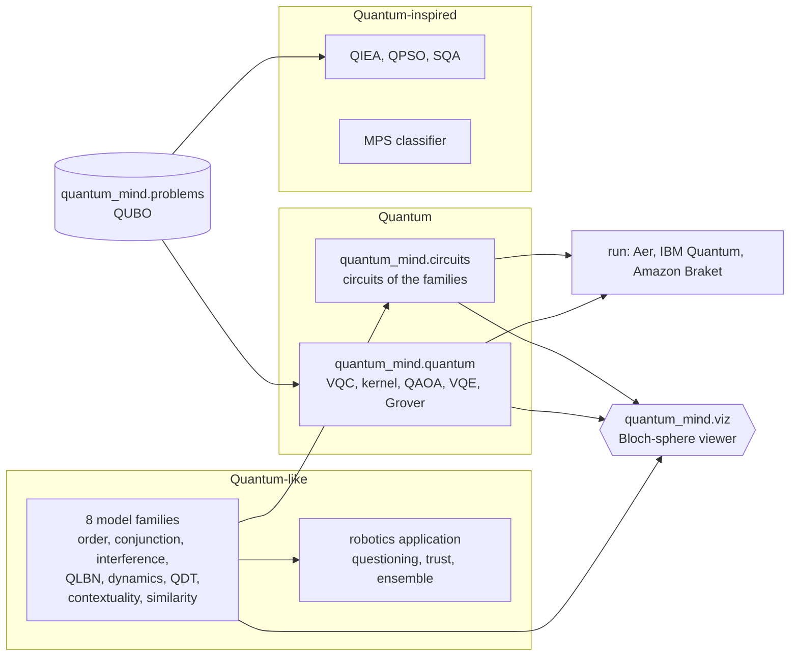

# Quantum-like, quantum and quantum-inspired

The word "quantum" is used in three different senses. This package covers all three and keeps them
apart, because each makes a different claim and needs a different test.

| | Quantum-like | Quantum | Quantum-inspired |
|---|---|---|---|
| **What is modelled** | Human judgement, decision and trust | Any task posed as a quantum computation | Any optimisation or learning task |
| **Mathematics** | Quantum probability: state vectors, projectors, interference, open-system dynamics | Gate-model circuits: unitaries, measurement, parameterised ansatz | Classical algorithms that borrow a quantum idea |
| **Runs on** | Any computer (microseconds); optionally as a circuit | A quantum computer or a simulator of one | Any computer |
| **The claim** | People's answers violate classical probability in ways quantum probability predicts | A circuit solves or learns the task (advantage is open and problem-specific) | The quantum idea gives a useful heuristic |
| **How to test it** | Against classical cognitive models on human data: BIC, QQ equality, total-probability bounds, contextuality criteria | Against the exact answer and classical baselines; on hardware, against noise | Against classical heuristics with equal budgets |
| **In this package** | `quantum_mind.families` (8 families), `quantum_mind.applications.robotics`, `quantum_mind.circuits` | `quantum_mind.quantum` (VQC, quantum kernel, QAOA, VQE, Grover) | `quantum_mind.inspired` (QIEA, QPSO, SQA, MPS classifier) |

## How they connect

- A quantum-like model is a set of vectors and projectors; `quantum_mind.circuits` turns it into a quantum
  circuit, so the same model can be executed on quantum hardware (a representation, not a speed-up).
- `quantum_mind.problems` gives quantum (QAOA) and quantum-inspired (SQA, QIEA) optimisers the same QUBO
  instances, with an exact answer for small sizes and a classical annealing baseline.
- `quantum_mind.viz` draws any of them on Bloch spheres: circuit trajectories, the trust qubit of the
  open-system belief model, and states measured on real backends.

## Choosing

- Modelling **people** (answers, choices, trust, similarity)? Start with the quantum-like families and
  always fit the classical baselines next to them.
- Studying **quantum computation** on a task, or teaching it? Use `quantum_mind.quantum` and run the circuits
  on Aer and on hardware; compare with the exact result.
- Need a **practical optimiser** today on a CPU? Try the quantum-inspired solvers next to classical
  simulated annealing, with the same evaluation budget.
