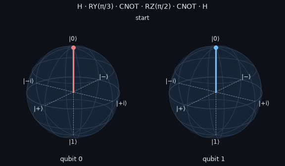

# Bloch-sphere viewer (`qlcog.viz`)

See qubits move in 3D: gate by gate through any Qiskit circuit, event by event through a quantum-like
trust model, or as measured on a simulator or quantum hardware.

<p align="center"></p>

| Function | Output | Needs |
|---|---|---|
| `bloch_vector(state)`, `bloch_vectors(state)` | Bloch vectors of one qubit or every qubit (reduced states of entangled qubits lie inside the ball) | NumPy |
| `circuit_trajectory(qc, steps)` | `Trajectory`: each gate applied in fractional steps U^(k/steps), so rotations draw arcs | Qiskit |
| `belief_trajectory(model, events)` | `Trajectory` of the belief qubit of `OpenSystemBelief` (rotation, then dephasing) | NumPy |
| `bloch_tomography(qc, backend, shots)` | Bloch vectors estimated from X, Y, Z measurements on `aer`, `aer:FakeTorino`, `ibm:…`, `braket:…` | Qiskit (+ backend) |
| `plot_bloch(vectors)`, `BlochSphere` | Static Matplotlib figure; add vectors, points, trajectories | Matplotlib |
| `animate_trajectory(traj, save='x.gif')` | Matplotlib animation; GIF (Pillow) or MP4 (ffmpeg); optional camera rotation | Matplotlib |
| `bloch_figure(vectors)` | Interactive Plotly figure (rotate, zoom, hover) | Plotly |
| `animate_bloch(traj)` + `save_html(fig, path)` | Interactive animation with play/pause and a labelled slider; standalone HTML | Plotly |
| `LiveBloch(n).show(); .update(state); .play(traj)` | Real-time spheres: a Plotly `FigureWidget` in Jupyter, a Matplotlib window elsewhere | Plotly + ipywidgets + anywidget, or Matplotlib |
| `concurrence(rho)`, `entanglement_summary(state)`, `traj.concurrence(a, b)` | Pairwise entanglement (Wootters concurrence; checked against Qiskit) and Bloch-vector lengths | NumPy |
| `plot_entanglement(traj)` | Timeline of Bloch lengths and concurrence along a circuit, labelled by gate | Matplotlib |
| `plot_qsphere(state)` | Q-sphere of a multi-qubit state (Qiskit's `plot_state_qsphere`) | Qiskit, Matplotlib, seaborn |

```python
from qiskit import QuantumCircuit
from qlcog.viz import circuit_trajectory, animate_bloch, save_html, animate_trajectory, LiveBloch

qc = QuantumCircuit(2); qc.h(0); qc.cx(0, 1); qc.ry(0.6, 1)
traj = circuit_trajectory(qc, steps=15)
save_html(animate_bloch(traj, title='Bell state'), 'bell.html')     # open in a browser
animate_trajectory(traj, save='bell.gif', rotate=0.5)              # for slides and READMEs

live = LiveBloch(2).show()          # Jupyter: an interactive widget that updates in place
live.play(traj, fps=30)             # or call live.update(state) inside a simulation loop
```

**Themes.** `theme='dark'` (default, GitHub dark palette) or `'light'`, or a dict with the keys of
`qlcog.viz.THEMES['dark']`.

**Conventions.** Qiskit qubit order (qubit q is bit q of the basis index); |0⟩ at the north pole,
|+⟩ on +x, |+i⟩ on +y. In the trust model, the north pole means "yes, I trust the robot".

**Relation to Qiskit's own plots.** `qiskit.visualization.plot_bloch_multivector` draws one static
state. `qlcog.viz` adds trajectories through a circuit, animation, interactive HTML, live updating and
tomography from real backends; it accepts Qiskit `Statevector` and `DensityMatrix` objects directly.
