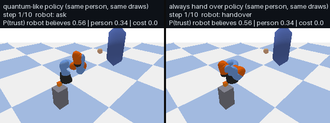

# quantum-handover: trust-aware robot hand-over

A robot arm hands objects to a person. Before each hand-over it chooses to **hand over**, **hand over
slowly**, **ask "Are you ready?"** or **wait**, by expected cost under a model of the person's trust in
the robot. The model is Quantum Mind's quantum-like trust model (trust as a qubit that changes with
every success and failure, and that a question changes as well as reveals), from
`quantum_mind.applications.handover`. All people here are simulated; no real participants are involved.



*Left: the quantum-like policy asks when trust is low and hands over slowly after a "no". Right: always
handing over. Same simulated person (initial P(trust) = 0.34) and the same random draws; the
quantum-like robot dropped 2 cubes (session cost 27.0), the other 5 (cost 50.0).*

## Why this model

Of the robotics models in Quantum Mind, the trust-aware hand-over is the one that is
**unique to Quantum Mind**, **quantum-like** (no quantum computer needed), makes a **physical decision**
a robot takes many times a shift, and has a **classical baseline** (the same policy on a Markov trust
model) to compare against. It is also the decision at the centre of collaborative assembly.

## What is in the package

| Module | What it does | Needs |
|---|---|---|
| `quantum_handover.policies` | robot policies (`quantum-like`, `markov`, `always hand over`, `always slow`) and populations of simulated people | `quantum-mind`, `numpy` |
| `quantum_handover.benchmark` | every policy against both populations | same |
| `quantum_handover.sim` | PyBullet simulation of a KUKA iiwa arm handing a cube to a person, saved as a GIF | `pybullet`, `pillow` |
| `quantum_handover.ros2_node` | ROS 2 node: events in on `/handover/events`, decisions out on `/handover/decision` (JSON strings) | ROS 2 Humble or later |

It is a Python package first. The simulation is optional, and the ROS 2 node is a thin layer over a
plain-Python controller, so the same decision logic runs in tests, in simulation and on a robot.

## Install and run

```bash
cd tutorials/trust_handover_package
pip install -r requirements.txt          # quantum-mind, numpy, pybullet, pillow, pytest
pip install -e .                          # or: pip install -e ".[sim,test]"

quantum-handover benchmark --people 300   # results table (about 1 s)
quantum-handover animate --out handover.gif   # PyBullet session, side by side (about 15 s, no GPU needed)
pytest tests                              # 6 tests; the simulation test is skipped without pybullet
```

On a robot with ROS 2:

```bash
python -m quantum_handover.ros2_node --policy quantum-like
ros2 topic pub --once /handover/events std_msgs/String '{data: "{\"outcome\": \"taken\"}"}'
ros2 topic echo /handover/decision
```

## Results

Each policy met 300 simulated people from each population for one session of 20 hand-overs. The robot's
model is set to population averages, never to the person in front of it. Session cost: 10 per dropped
cube, 1 per slow hand-over, 0.5 per question, 0.3 per wait (lower is better; ± one standard error).

| Simulated people | Policy | Mean session cost | Failures | Questions |
|---|---|---|---|---|
| quantum-like people | quantum-like | **39.8 ± 1.5** | 2.85 | 7.2 |
| quantum-like people | markov | 56.9 ± 1.0 | 4.73 | 4.6 |
| quantum-like people | always hand over | 93.9 ± 1.4 | 9.39 | 0.0 |
| quantum-like people | always slow | 68.9 ± 1.1 | 4.89 | 0.0 |
| Markov people | quantum-like | 27.8 ± 1.9 | 1.88 | 8.2 |
| Markov people | markov | **22.1 ± 1.9** | 1.71 | 1.9 |
| Markov people | always hand over | 104.2 ± 4.8 | 10.42 | 0.0 |
| Markov people | always slow | 41.0 ± 1.6 | 2.10 | 0.0 |

What this shows:

1. Both model-based policies beat both fixed policies, for both kinds of people.
2. Each model wins on the people who behave like it: the quantum-like policy on quantum-like people
   (39.8 against 56.9), the Markov policy on Markov people (22.1 against 27.8).
3. The quantum-like policy loses less when it is wrong: 5.7 more than the best policy on Markov people,
   against 17.1 more for the Markov policy on quantum-like people. When it is not known which kind of
   person the robot faces, the quantum-like policy is the safer choice in this simulation.

What it does not show: how real people behave. Note also one property of the quantum-like trust
model: every success and failure turns the trust state by a fixed angle, so right after a "yes" has made
trust certain, a success lowers it and a following failure can raise it slightly (tutorial 19, section 4). Which population real people resemble is the question
a user study has to answer; the population parameters here are illustrative, not fitted to data.

## Requirements

`requirements.txt` lists everything for the benchmark, the simulation and the tests. Only
`quantum-mind>=2.0.1` and `numpy` are needed for the policies and the benchmark; `pybullet` and `pillow`
for the simulation; `rclpy` and `std_msgs` come with a ROS 2 installation, not from pip.

## Citing

Cite Quantum Mind (`CITATION.cff` in the repository root) and the trust model's sources: Busemeyer, J. R.,
& Bruza, P. D. (2024). *Quantum Models of Cognition and Decision* (2nd ed.). Cambridge University Press;
Roeder, L., et al. (2023). A quantum model of trust calibration in human-AI interactions. *Entropy*,
25(9), 1362.

Licence: Apache-2.0, as Quantum Mind.
